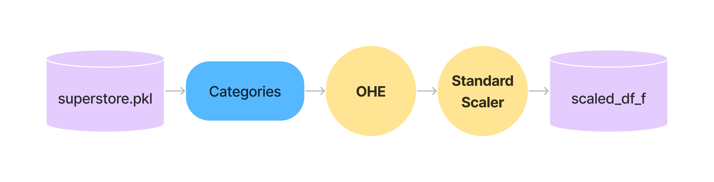
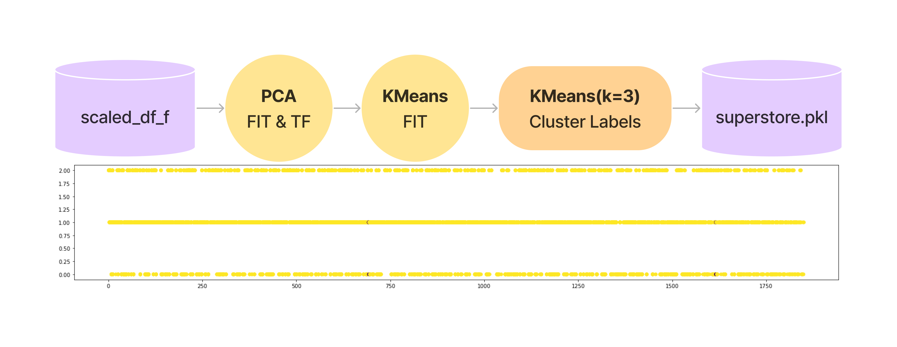
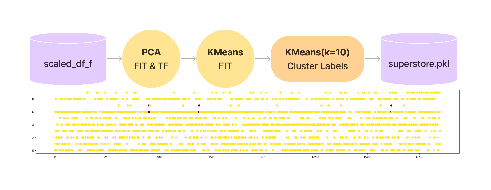
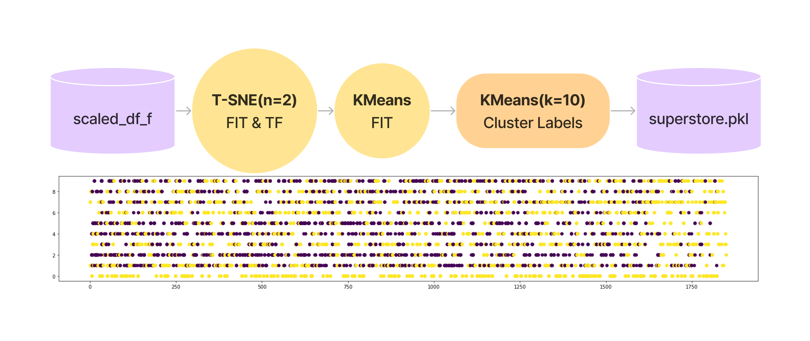

# Data Guide

## The Default Starting Point

> *superstore.pkl* dataframe object

- ***superstore.pkl*** replaces the original boilerplate preprocessing steps [^1] [^2]

[^1]: ../archive/bp.ipynb
[^2]: ../archive/bp.py

## original dataset

> archive/superstore_sample.csv

## HJ's dataframes
### OHE&Scaled dataframe

### PCA-KMeans: KMC k=4

### PCA-KMeans: KMC k=10

### PCA-KMeans: PCA n=4, KMC k=10

### T-SNE-KMeans: T-SNE n=4, KMC k=10

